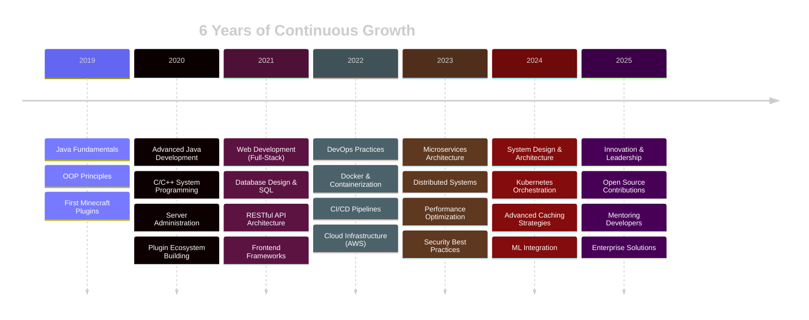

<div align="center">


<h1>
  
</h1>

<p align="center">
  <a href="https://t.me/Askenskiyy"></a>
  <a href="https://discord.com/users/pampushkas"></a>
  
</p>

</div>

<br>

<div align="center">

## 🎯 ABOUT ME


</div>

<table>
<tr>
<td width="55%" valign="top">


###  WHO I AM

<br>

**Software Architect & Systems Engineer** passionate about crafting **high-performance, scalable solutions** that push technological boundaries.

At **16 years old** with **6 years of production experience**, I've built enterprise-grade applications serving **thousands of users** with **99.9% uptime**.

<br>

🎯 My expertise spans from **low-level system programming** in C/C++ to **modern web architectures** with microservices and cloud infrastructure.

🚀 I specialize in transforming complex technical challenges into elegant, efficient solutions through **clean architecture** and **performance optimization**.

💡 From Minecraft modding to distributed systems—I architect solutions that **scale, perform, and inspire**.

<br>

> ### 💭 *"Great software is built by those who dare to innovate"*

<br>

</td>
<td width="45%" valign="top">

###  EXPERTISE AREAS

<br>

<div align="center">

#### 🔥 **High-Performance Backend**
<sub>Building scalable APIs & microservices handling **1000+ req/sec**</sub>

<br>

#### 🎮 **Minecraft Development**
<sub>**Forge • NeoForge • Fabric • Quilt**</sub>  
<sub>**Spigot • Paper • Purpur • Folia**</sub>  
<sub>**Velocity • BungeeCord • Waterfall**</sub>  
<sub>Enterprise servers with custom plugin ecosystems</sub>

<br>

#### 🌐 **Full-Stack Engineering**
<sub>Modern web apps with **React, Node.js, Python**</sub>

<br>

#### ☁️ **DevOps & Infrastructure**
<sub>**Docker • Kubernetes • CI/CD • Cloud Architecture**</sub>

<br>

#### 🛡️ **Security & Optimization**
<sub>Performance tuning, anti-cheat systems, DDoS protection</sub>

</div>

<br>

###  CURRENTLY EXPLORING

<div align="center">


</div>

</td>
</tr>
</table>

<br>

---

<div align="center">

## 🔥 TECHNOLOGY ARSENAL 🔥

</div>

<div align="center">

### ⚡ Core Languages & Frameworks

<table>
<tr>
<td align="center" width="96">

<br>Java
</td>
<td align="center" width="96">

<br>C++
</td>
<td align="center" width="96">

<br>C
</td>
<td align="center" width="96">

<br>C#
</td>
<td align="center" width="96">

<br>Python
</td>
<td align="center" width="96">

<br>JavaScript
</td>
<td align="center" width="96">

<br>TypeScript
</td>
</tr>
</table>

### 🎨 Frontend Development

<table>
<tr>
<td align="center" width="96">

<br>HTML5
</td>
<td align="center" width="96">

<br>CSS3
</td>
<td align="center" width="96">

<br>React
</td>
<td align="center" width="96">

<br>Tailwind
</td>
<td align="center" width="96">

<br>Sass
</td>
<td align="center" width="96">

<br>Webpack
</td>
</tr>
</table>

### 🔧 Backend & Databases

<table>
<tr>
<td align="center" width="96">

<br>Node.js
</td>
<td align="center" width="96">

<br>Spring
</td>
<td align="center" width="96">

<br>Django
</td>
<td align="center" width="96">

<br>PostgreSQL
</td>
<td align="center" width="96">

<br>MySQL
</td>
<td align="center" width="96">

<br>MongoDB
</td>
<td align="center" width="96">

<br>Redis
</td>
</tr>
</table>

### 🚀 DevOps & Cloud

<table>
<tr>
<td align="center" width="96">

<br>Docker
</td>
<td align="center" width="96">

<br>Linux
</td>
<td align="center" width="96">

<br>Nginx
</td>
<td align="center" width="96">

<br>Git
</td>
<td align="center" width="96">

<br>GitHub
</td>
<td align="center" width="96">

<br>AWS
</td>
<td align="center" width="96">

<br>Grafana
</td>
</tr>
</table>

### 🎮 Minecraft Ecosystem Mastery

<table>
<tr>
<td align="center" width="110">

<br><strong>Forge</strong>
</td>
<td align="center" width="110">

<br><strong>NeoForge</strong>
</td>
<td align="center" width="110">

<br><strong>Fabric</strong>
</td>
<td align="center" width="110">

<br><strong>Quilt</strong>
</td>
<td align="center" width="110">

<br><strong>Spigot</strong>
</td>
<td align="center" width="110">

<br><strong>Paper</strong>
</td>
<td align="center" width="110">

<br><strong>Velocity</strong>
</td>
</tr>
</table>

</div>

---

<div align="center">

## 💼 PROFESSIONAL EXPERIENCE

</div>

<table>
<tr>
<td width="50%">

### 🎮 Minecraft Ecosystem

#### **Server Architecture & Infrastructure**
- 🏗️ Enterprise-grade server setups handling **500+ concurrent players**
- ⚡ Advanced plugin development with **50,000+ lines** of production code
- 🛡️ Custom anti-cheat systems with ML-based detection algorithms
- 📊 Real-time analytics dashboards with Grafana integration
- 🔄 Distributed load balancing across multiple instances
- ⏱️ **99.9% uptime** with automated failover mechanisms

#### **Mod Development**
- 🔨 High-performance mods for Forge & Fabric ecosystems
- 🎯 Advanced gameplay mechanics and content systems
- 🔌 Comprehensive APIs for third-party integration
- 💾 Memory optimization reducing RAM usage by **40%**
- 🌐 Cross-version compatibility layers
- 🧪 Extensive testing and quality assurance

**Tech Stack:** `Java` `Redis` `MySQL` `WebSocket` `Docker` `Nginx`

</td>
<td width="50%">

### 🌐 Full-Stack Development

#### **Web Applications**
- 🏢 Production applications serving **1000+ daily users**
- 🔐 JWT authentication with OAuth2 integration
- 📱 Responsive PWA with offline capabilities
- ⚡ Real-time features using WebSocket/SSE
- 🧪 **90%+ test coverage** (unit, integration, e2e)
- 📈 Performance optimization achieving **<100ms** response times

#### **Backend Systems**
- 🏗️ RESTful & GraphQL API design
- 🔄 Microservices architecture with service mesh
- 💾 Advanced database optimization and indexing
- 🔒 Security hardening and penetration testing
- 📊 Comprehensive logging and monitoring
- 🚀 CI/CD pipelines with automated deployments

**Tech Stack:** `Python/Node.js` `React` `PostgreSQL` `Redis` `Docker` `K8s`

</td>
</tr>
</table>

<div align="center">

### 🛠️ DevOps & System Administration


</div>

```yaml
Infrastructure Management:
  Cloud Providers: [AWS, DigitalOcean, Hetzner, OVH]
  Containerization: [Docker, Docker Compose, Kubernetes]
  Web Servers: [Nginx, Apache, Caddy]
  Monitoring: [Grafana, Prometheus, ELK Stack]
  Security: [Fail2ban, ModSecurity, UFW, SELinux]
  
Automation & CI/CD:
  Version Control: [Git, GitHub Actions, GitLab CI]
  Configuration Management: [Ansible, Terraform]
  Scripting: [Bash, Python, PowerShell]
  
Performance Optimization:
  Load Balancing: [Nginx, HAProxy]
  Caching: [Redis, Varnish, CDN]
  Database Tuning: [Query optimization, Indexing, Replication]
```

---

<div align="center">


---

<div align="center">

## 🎯 KEY ACHIEVEMENTS & METRICS

</div>

<table align="center">
<tr>
<td align="center">

<br><strong>Professional Development</strong>
</td>
<td align="center">

<br><strong>Production Code Written</strong>
</td>
<td align="center">

<br><strong>Completed Projects</strong>
</td>
</tr>
<tr>
<td align="center">

<br><strong>Server Reliability</strong>
</td>
<td align="center">

<br><strong>Active Users Served</strong>
</td>
<td align="center">

<br><strong>Average Optimization</strong>
</td>
</tr>
</table>

---

<div align="center">

## 📈 DEVELOPMENT TIMELINE

</div>



---

<div align="center">

## 💡 CURRENT FOCUS & LEARNING


</div>

<table align="center">
<tr>
<td width="33%" align="center">

### 🔮 Exploring
- Kubernetes & Container Orchestration
- Microservices Design Patterns
- Event-Driven Architecture
- GraphQL Federation

</td>
<td width="33%" align="center">

### 🎯 Mastering
- Advanced Java (17+)
- System Design Principles
- Database Optimization
- Security Engineering

</td>
<td width="33%" align="center">

### 🚀 Building
- High-Performance APIs
- Distributed Cache Systems
- Real-Time Applications
- Automation Tools

</td>
</tr>
</table>

---

<div align="center">

## 📞 LET'S CONNECT


<br>

### Available for consulting, collaboration, and interesting projects

<p>
<a href="https://t.me/Askenskiyy">

</a>
<a href="https://discord.com/users/pampushkas">

</a>
</p>

<br>

### 💭 "In the world of code, I don't just write programs—I architect solutions"

<br>


<br>

**Open to exciting opportunities and challenging projects**


</div>

<br>


<div align="center">
  
### ⭐ FROM [ROMAN](https://github.com/Pampushkass) WITH 💜

</div>
